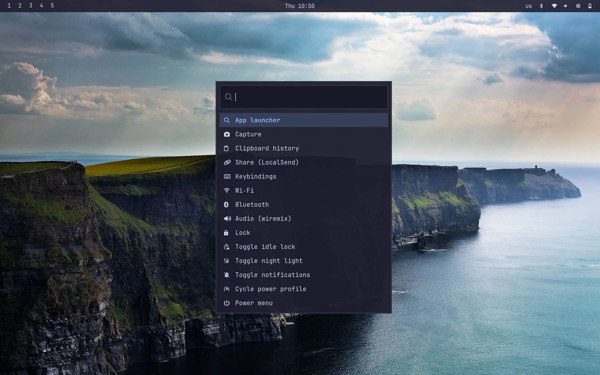
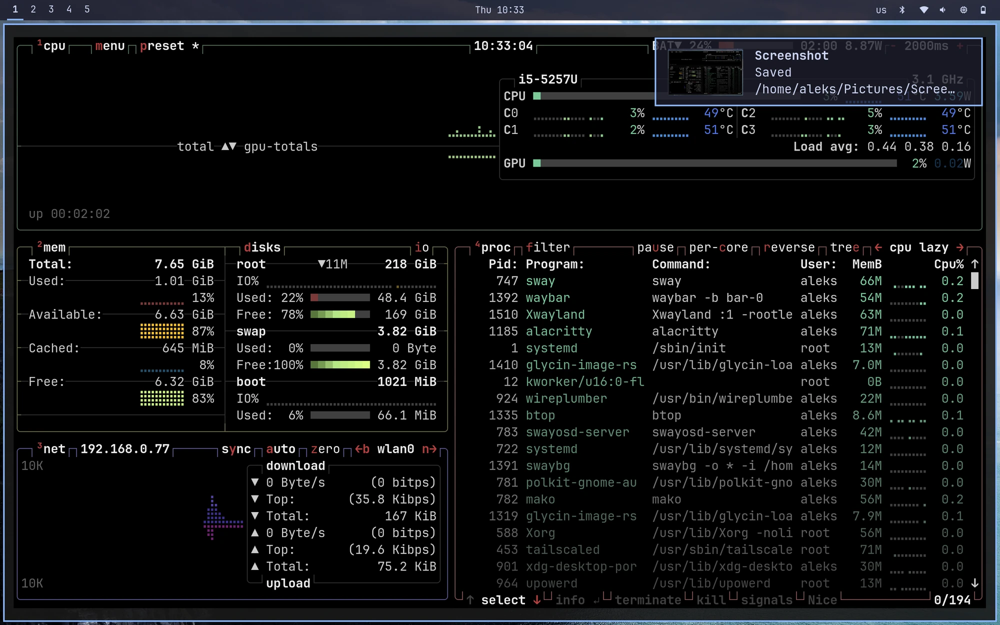

# Arch → sway desktop bootstrap

Turn a **minimal Arch** install into this machine’s sway desktop (packages, services, and [dotfiles](https://github.com/alekskin/dotfiles)).

## Screenshots

What `bootstrap.sh` gets you after the reboot:


*The system menu (`Super+Escape`) over the desktop — waybar on top: workspaces, clock, and the tray (keyboard layout, bluetooth, network, volume, settings, battery).*


*btop in alacritty, with a mako notification for a fresh screenshot.*

## What you need first

From `archinstall` or a manual install:

1. Bootable Arch system
2. A **normal user** (archinstall: *User account* → add a superuser)

This repo does **not** replace partitioning, bootloader, or creating the user.
Networking is handled for you by stage 1 below.

## Install — one command, from the live ISO

A fresh install has no networking. The live ISO's connection isn't carried over,
and the drivers and daemons that made it work there (the Broadcom Wi-Fi driver,
`usbmuxd` for iPhone tethering) aren't in a bare `pacstrap` install either. So
rather than reboot and hope the machine can reach the internet, **do the entire
install while the ISO is still online**:

```bash
# in the live ISO, network up (tethering is fine), system installed to /mnt
pacman -Sy git
git clone https://github.com/alekskin/arch.git /mnt/root/arch
arch-chroot /mnt /root/arch/bootstrap.sh
reboot
```

That single run does networking, drivers, every package, the AUR builds and the
dotfiles — you reboot straight into SDDM with a working desktop. Nothing that
needs a network is left for after the reboot.

`bootstrap.sh` detects that it's in a chroot: units are enabled for the next
boot rather than started, and the network comes from the ISO. Under the hood it
runs `setup.sh` for you (see *Stages*, below).

Already ran `archinstall`'s "chroot into the installation?" prompt? You're
inside already — skip `arch-chroot` and run `/root/arch/bootstrap.sh` directly,
after `pacman -Sy git` (a base install has no git).

### On an already-booted system

The same script works as root on a machine that's online some other way:

```bash
./bootstrap.sh
```

If it can't reach the network and `iwd`/the Wi-Fi driver aren't installed, there
is nothing it can do offline — boot the ISO and use the flow above.

### Stages

| Stage | Who | What | When |
|-------|-----|------|------|
| `bootstrap.sh` | root | network, Wi-Fi driver, tethering, then all of stage 2 | from the ISO, before first boot |
| `setup.sh` | your user | packages, AUR, services, desktop, dotfiles | driven by stage 1; re-runnable later |

`setup.sh` still works standalone as your user — it's idempotent, so re-run it
any time to top things up. Env vars for stage 1:

| Variable | Meaning |
|----------|---------|
| `SKIP_STAGE2=1` | stage 1 only; download stage 2's packages to the cache instead |
| `SKIP_CACHE=1` | with `SKIP_STAGE2=1`, skip the download too |
| `INSTALL_HARDWARE=…` | override Wi-Fi hardware auto-detection |

### Left for after the reboot

Only things that genuinely need a running system:

```bash
cd ~/arch && SETUP_FINGERPRINT=1 ./setup.sh   # enrolls a finger; needs the sensor
sudo tailscale up                             # needs the daemon running
# log out and back in once, for the docker group
```

#### Getting the repo onto the machine with no network

Chicken-and-egg: cloning needs network, and stage 1 is what sets network up.
Pick whichever applies:

- **Clone from the live ISO before rebooting** — this is the chroot flow above,
  and it's why it's the recommended one.
- **Wired / VM:** plug in Ethernet, then `pacman -Sy git` and clone normally.
- **Stuck without either:** bring wired DHCP up by hand — all of this is built
  into systemd, so it downloads nothing — then clone:

  ```bash
  printf '[Match]\nName=en* eth* usb*\n\n[Network]\nDHCP=yes\n' \
    > /etc/systemd/network/20-wired.network
  systemctl enable --now systemd-networkd systemd-resolved
  ln -sf /run/systemd/resolve/stub-resolv.conf /etc/resolv.conf
  pacman -Sy git
  ```

  (Running `bootstrap.sh` afterwards is still fine — it is idempotent.)

### Networking after the reboot

| Uplink | What happens |
|--------|--------------|
| Ethernet | DHCP automatically (`20-wired.network`) |
| USB tethering | DHCP automatically (`25-tether.network` matches `ipheth`/RNDIS/NCM). Plug in, enable tethering on the phone; on iPhone unlock and *Trust This Computer* |
| Wi-Fi | `iwctl station wlan0 connect <SSID>` |

`systemd-networkd-wait-online` is deliberately left disabled. Enabling networkd
turns it on as well, and it holds `network-online.target` until a
networkd-managed link is configured — which on a Wi-Fi-only machine never
happens, since iwd owns `wlan0`. It would spend its full 120s timeout on every
boot and delay everything ordered after `multi-user.target`.

If Wi-Fi won't associate on a Broadcom `wl` card (iwd is known to be picky with
that driver), the fallback is installed but not enabled:

```bash
sudo systemctl disable --now iwd
sudo systemctl enable --now wpa_supplicant@wlan0 dhcpcd
```

### Running stage 2 by itself

Stage 1 already ran it, so this is only for re-runs and top-ups (new packages in
the list, dotfiles changes, hardware extras, fingerprint). It must **not** run
as root — dotfiles and the SSH key belong in a real `$HOME`, and makepkg refuses.

Stage 1 leaves a copy of this repo at `~/arch`, owned by your user: cloning to
`/root/arch` from the ISO is the natural thing to do, but `/root` is mode 750,
so your user could not read it there.

```bash
cd ~/arch
./setup.sh
```

At the **SDDM** login (minimal theme), pick session **Sway** and log in.

### Interactive prompts

When you run `./setup.sh` in a terminal it asks:

1. Install **AUR** packages (yay + `localsend-bin`, …)? **[Y/n]**
2. Install/stow **dotfiles**? **[Y/n]**  
   - If yes and dotfiles are missing: git URL + directory
3. **Hardware extras**:
   - `1) none` (default)
   - `2) macbook` — Broadcom Wi‑Fi (`broadcom-wl-dkms`); normally already installed by stage 1
   - `3) amd` — AMD GPU stack (`vulkan-radeon`, VA-API, `amdgpu`, `amd-ucode`)
4. **Fingerprint** auth for sudo/polkit? **[y/N]** — only say yes on a machine
   with a sensor; it enrolls a finger (needs you present). Falls through to
   password, so it can't lock you out.
5. Confirm and continue

Defaults are the usual full install (AUR + dotfiles, no hardware extras).

### Non-interactive / automation

Env vars skip prompts for those choices:

| Variable | Meaning |
|----------|---------|
| `DOTFILES_DIR` | Path to dotfiles (default `~/dotfiles`) |
| `DOTFILES_REPO` | Git URL if clone needed |
| `INSTALL_HARDWARE=macbook` | MacBook Wi‑Fi packages |
| `INSTALL_HARDWARE=amd` | AMD GPU/CPU packages |
| `SKIP_DOTFILES=1` | Packages/services only |
| `SKIP_AUR=1` | Skip yay + AUR |
| `SETUP_FINGERPRINT=1` | Enroll + wire fingerprint (needs a sensor) |

Example:

```bash
SKIP_AUR=1 INSTALL_HARDWARE=macbook ./setup.sh
```

## What `setup.sh` does

1. `pacman -Syu` + install `packages/packages.txt`
2. Optional hardware package file
3. Bootstrap **yay** (`yay-bin`) and install `packages/packages-aur.txt`
4. Systemd: logind power-key, **systemd-resolved**, **iwd**, **bluetooth**, **sddm**, **docker**, **tailscaled**, **power-profiles-daemon**
5. Clone/stow **dotfiles** via `dotfiles/install.sh`
6. `xdg-user-dirs-update` + MIME defaults (`config/mimetypes.sh`)
7. Generate an SSH key at `~/.ssh/id_github` if missing
8. Optional: **fingerprint** enrollment + PAM (`config/fingerprint-setup.sh`)

## Repo layout

```text
arch/
  bootstrap.sh                   # stage 1, root (chroot-aware)
  setup.sh                       # stage 2, your user
  packages/
    packages-bootstrap.txt       # offline-critical set (stage 1)
    packages.txt                 # official repos
    packages-aur.txt             # AUR (localsend-bin, …)
    packages-hardware-macbook.txt
    packages-hardware-amd.txt
  config/mimetypes.sh
  iwd/main.conf
  systemd/20-wired.network       # Ethernet DHCP
  systemd/25-tether.network      # USB tethering DHCP
  systemd/ignore-power-key.conf
  screenshots/                   # README images
  README.md
```

Desktop config (sway, waybar, bash, …) lives in the **dotfiles** repo, not here.

## After first login

| Task | How |
|------|-----|
| Wi‑Fi | `Super+Ctrl+W` or `impala` |
| App launcher | `Super+D` |
| System menu | `Super+Escape` |
| Tailscale | `sudo tailscale up` |
| Docker group | log out/in once after setup |
| Dotfiles only | `~/dotfiles/install.sh` |

## Fresh machine checklist

- [ ] Arch installed, user + sudo, network up  
- [ ] `./setup.sh` completed without errors  
- [ ] Rebooted into SDDM → **Sway**  
- [ ] Waybar / terminal / Super+D work  
- [ ] (MacBook) Wi‑Fi works — `broadcom-wl-dkms` installed by stage 1  

## Not in scope

- Full theming / Omarchy theme switcher  
- NVIDIA-specific stacks (add packages yourself if needed)  
- Replacing archinstall / disk layout  
